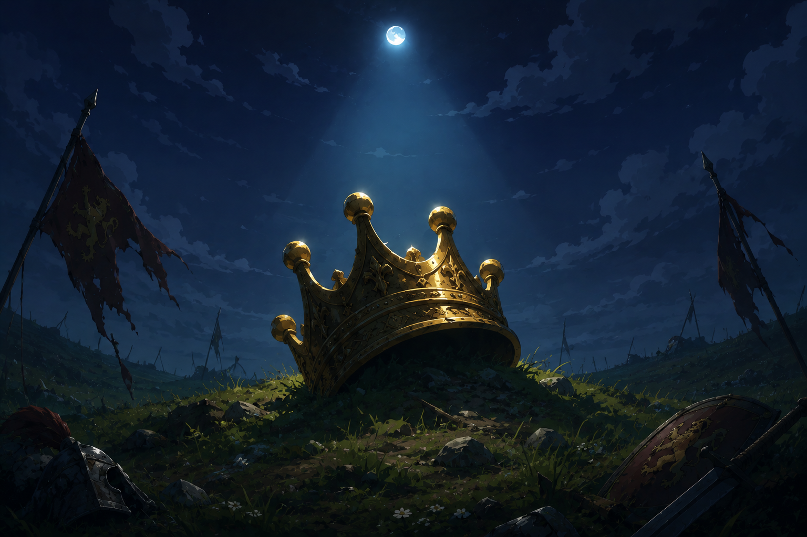

## How Queens Die: Analysing a 6 Million Puzzle Database



**TLDR; AI Summary**:
> When I read your draft, I still thought  
**"Oh, someone categorized tactics."**  
Now I understand it's closer to  
**"Imagine opening a tactics book where every single exercise demonstrates exactly the same motif—but in thousands of completely unrelated games."**  
That is a new learning experience.
And it's one that only exists because of **GofChess**.

How many ways can you lose your queen in a chess game? There are different levels of complexity where the loss of a queen becomes unavoidable due to a blunder, and presents itself as a chess puzzle in the Lichess puzzle database. In this blog post we will try to answer this question. From obvious hanging of a queen, to knight forks or bishop discoveries, to queen traps or desperade queen sacrifices. We will count them all and present statistical data extracted from 6 million Lichess puzzles. We will break down the numbers and look at real examples taken from actual games.

Then, we will delve deeper into side examples, exceptions, counter attacks, that break the pattern of those simple obvious tactics we present in the first section — making content designed to appeal to more advanced players.

Finally, we will mention the method behind this research, namely **GofChess Language 2.0**, the modernized and significantly improved successor of the earlier version [we introduced this past May](https://lichess.org/@/heroku/blog/gofchess-a-technical-dive-into-formalization-of-chess-tactics/KULHdYDn).


As a side note: we have built a [showcase of these lists here](https://eguneys.github.io/gofchess-puzzler-27/) where you can solve the puzzles. This is an experience of a new kind, where you are constantly seeing the same pattern but on completely different chess positions.

## Basic Patterns

Our overall conclusion over finding these basic patterns is, Queen can always be the first one to save when under a threat, apart from a checkmate, thus the other side of the double threat is usually to the king, where the queen is lost, as the king escapes.

But before we get started, we want to mention our coverage is not exhaustive, since we don't include every piece combination for every case, but some special cases we find is sufficient for demonstration purposes is included. This is mostly not due to a limitation of the gof scripts, but for the sake of keeping a compact proof of concept.

### Bishop Checks King with a Discovered Attack on Hanging Queen

First we have to explain what exactly we are searching for, and what the corresponding GofChess script looks like to express that:

The Gof script:

```
queen_t .eyesThrough queen2 .through bishop
                     .hanging
bishop_t *Captures opponent *becomes bishop2
                                  .cannotBeCapturedBy queen2
         .Checks king_t
turn  *Captures bishop2 *becomes opponent2
                                    .doesNotDefend queen2
queen *Captures queen2 *becomes queen3
```

Explanation in English:
```
Our queen attacks opponent's queen but there is our bishop in between them.
Opponent's queen is hanging, otherwise has no defenders.
Our bishop captures an opponent's piece, while giving a check to the king. 
But also the bishop cannot be captured by their hanging queen.
Our bishop is captured by the opponent. But meanwhile capturing piece doesn't defend the hanging queen.

At this point our queen can capture the opponent's hanging queen. Queen is lost.
```

Here are some examples:

- https://lichess.org/training/00DTg
- https://lichess.org/training/00E29
- https://lichess.org/training/00xGN
- https://lichess.org/training/017Ut
- https://lichess.org/training/01Ag5


Among 6 million puzzles, there are a total of **15782** puzzles that fits this description, and solved with this exact sequence.

If we change our description slightly, such as instead of our bishop capturing something while giving check, to bishop simply moving to a vacant square while giving check, we find roughly about **3216** puzzles. Here's a couple examples:

- https://lichess.org/training/00gSv
- https://lichess.org/training/02ra2
- https://lichess.org/training/02zVb
- https://lichess.org/training/03wTh


### Bishop Skewers King and Queen

This is a basic skewer tactic where bishop checks the king, but also the queen behind it, so when the king moves, bishop can capture the queen.

The Gof script:

```gof
bishop_t *Checks king_o *becomes bishop2
         .eyesThrough queen_t .through king_t
king *Evades bishop2 *becomes king2
bishop2 *Captures queen *becomes bishop3
```

We found only **1053** positions across all puzzles in the database. But while these are exact matches with this exact solution, there are still some different considerations that are not accounted for. Such as the puzzle begins with this sequence but continues, or after the Bishop check, king doesn't evade but there is a desperado block, they are simply not checked for.

Bishop skewers were suprisingly low for some reason, let's take a look at rook skewers and queen skewers:

- Rook skewers: **4278**
- Queen skewers: **6780**

### Knight Forks King and Queen

There are total of **69695** puzzles where knight forks king and queen and captures the queen next move. You can view all of them on the showcase website. Feel free to try it out, it's surely a different kind of experience to be bombarded with knight forks all over the place. There is something soothing about it.

### Pawn Forks King and Queen

Due to dual nature of pawn movement, where it can push forward but only captures diagonally and when there is a piece around, we simply haven't integrated the pawns into the GofChess Language 2.0 yet. Hopefully in the future we can express those just as well as everything else.

This one is about pawn pushes forward and attacks both king and queen at the same time. We reckon it's quite common, and hope to cover it in the future. We will continue to add more content on the showcase page, so consider adding a bookmark.

### Pawn Checks King with a Discovered Attack on Hanging Queen

This one again a rare gem of a tactic, it feels so good to pull this off, it feels similar to a queen skewer we covered before, but when the pawn moves with check, it discovers an attack on the queen by another piece of ours, and when the king evades the check, our piece captures the queen.

### Immediately Hanging the Queen

This one has a suprising result. Let me show you the output of the script:

```
0.01 ms per puzzle, took 46560ms
FirstM:6767 N:6002012 F:0 FF:0 T:0 FullT: 5603
Coverage:0.21% Accuracy:54.70%
Total:6014382                                                        
1579 https://lichess.org/training/0119E
[Qxf8#] fullTrueMatch
1: {}
2: {Qxf8#}
```


There are **5603** puzzles where the solution is a simple capturing of the hanging queen. **FullT: 5603** means 5603 puzzles matched our script that the matching moves are also exactly equal to the puzzle solution. 

More interestingly **FirstM: 6767** means 6767 puzzles matched correctly for the first moves to the solution, but the puzzle continues, _or the rest of the match is a false match_. 

But look at the rest of the statistics: **F: 0 FF: 0**, meaning there is no false positives, that is our script didn't match any moves that is not the solution.

Thus, if you want to take away anything from this article here it is:

> If you can capture a hanging queen, capture it without thinking. That is 100% correct.

Probably too bold? But the statement actually holds for capturing the hanging queen with your own queen not with any other piece. And it is true within 6 million puzzle database.

Also note that *hanging* means *it is not defended by any piece*.

Interested in other pieces capturing the hanging queen? Let's take a look:

- Bishop captures hanging queen: **FirstM:4479** N:6009499 F:0 FF:0 T:0 **FullT: 404**
- Rook captures hanging queen: **FirstM:8586** N:6001108 F:0 FF:0 T:0 **FullT: 4688**
- Knight captures hanging queen: **FirstM:5035** N:6008963 F:0 FF:0 T:0 **FullT: 384**


We haven't double checked the numbers are correct one by one, but feel free to experiment by viewing and actually solving these puzzles on the showcase page we have linked in the introduction. They are all available, public and free for the community.


Initially we ran these scripts against 4.6 million old database, and when we switched to 6 million database all the numbers have increased, except for these two:
- Bishop captures hanging queen in 4.6 million old database: **FirstM:3883** N:4674744 F:0 FF:0 T:0 **FullT: 646**

- Knight captures hanging queen in 4.6 million old database: **FirstM:4481** N:4674070 F:0 FF:0 T:0 **FullT: 722**

If you have an opinion what might have caused this, feel free to share.

## Advanced Exceptions to Basic Patterns

We already know alwasy we have to capture a hanging queen whenever we can. But let's look at an exception where we have to fork a king and queen, but capturing the queen next move is not the best move. Or merely landing a knight fork on king and queen is not the best move. As you might have guessed there are thousands of those counter examples. We will show you what we mean with several examples, because that's the intersection where the beauty of chess emerges:


### Knight Captures The Queen after landing a fork but puzzle doesn't end

We searched for several patterns for the partial matches and here are the results:

- Knight lands a fork, captures the queen, but also defends their queen, then opponent captures the queen
  - knight recaptures. Total of **704** puzzles.
    - The above pattern plus puzzle still continues. Total of **14** puzzles.
  - knight doesn't recapture instead some other move is played. Total of **32** puzzles.

The only thing left here after landing the fork is, knight captures the queen, but it doesn't defend their own queen. There are total of **4301** puzzles with that pattern, but we won't delve deeper into this.


### Knight Can't Capture The Queen after landing a fork

This pattern although interesting probably most of them leads to mate. For example, we searched for these patterns after knight landing a fork:

- Instead of knight capturing the queen, rook checks the king, possibly delivering a mate: Total of **215** puzzles.
  - The above pattern, but the puzzle continues, there are total of **176** puzzles.

At this point, we stopped our investigation.

## Queen Traps

This one is not impossible to investigate, but a challenge we want to tackle in the future. Maybe for a next blog post about **General Piece Traps**.

## Methodology of GofChess Language v2.0


Even though this version streamlines most of the work, it's not fully automated yet. Because the use-cases for the language is still shaping up, we simply keep things flexible, by not working on a fixed pipeline, things change and we don't want to do any more work than we have to.


## Conclusion

To conclude this chapter, I would like to thank the Lichess Team, for presenting this amazing ecosystem, outreach to the community and tools that guided me with this entire research.

Lichess recently launched the 6 million puzzle database, we started with the old database with 4.6 million puzzles, then we re-run all the scripts on the new database. Numbers have changed, we fixed bugs on filters that categorize the puzzles, re-crunched the numbers. But the results are automated and fully reproducible. If we made any mistakes please let us know.

We are happy to hear your best wishes to continue this amazing journey, and share our experiences with all of you. What do you think, did we miss some aspects, or have ideas for our next research topic, interested in how GofChess Language works, inspired by another creative use case for it?

If you want to reproduce the results, or make your own compilations, send us a DM at https://lichess.org/@/heroku for more information.

May the Queens of the game of chess bring us all the good luck in the universe that will never die.

PS: I feel like I am having a déjà vu.